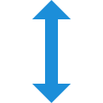

[](https://circleci.com/gh/qmixi/react-full-height) [![Issues][issues-shield]][issues-url] [](https://www.npmjs.com/package/react-full-height) [](https://www.npmjs.com/package/react-full-height) [![MIT License][license-shield]][license-url]

<br />
<br />
<br />
<p align="center">
  <a href="https://github.com/qmixi/react-full-height">
    
  </a>

  <h2 align="center">React Full Height</h2>

  <p align="center">
    Responsive component helping you make perfect full viewport height sections 
    <br />
    <br />
    <a href="https://qmixi.github.io/react-full-height/demo/">View Demo</a>
    ·
    <a href="https://github.com/qmixi/react-full-height/issues">Report Bug</a>
    ·
    <a href="https://github.com/qmixi/react-full-height/issues">Request Feature</a>
  </p>
</p>
<br />

<!-- GETTING STARTED -->

## Getting Started

This component has been built to help you create responsive and customizable full-height sections. You can always have a full-height section or you can adjust `FullHeight` component easily to achieve full-height effect only in mobile, desktop or in some specific resolution range.

### Installation

With `npm`

```sh
npm install --save react-full-height
```

Or with `yarn`

```sh
yarn add react-full-height
```

<!-- USAGE EXAMPLES -->

## Usage

### Basic usage

The very basic usage is to just wrap your content in `FullHeight`.

```jsx
import React from "react";
import FullHeight from "react-full-height";

const MySection = () => <FullHeight>My section content</FullHeight>;
```

### Passing className and section default props

`<FullHeight />` renders a `section`, and it will accept any usual `div`/`section` props, including `className`.

```jsx
import React from "react";
import FullHeight from "react-full-height";

const MyCustomSection = () => (
  <FullHeight className="section-styles">
    <h2>My section title</h2>
    <p>Full-height section content</p>
  </FullHeight>
);
```

### Follow the content height when it exceeds the viewport height

By default `<FullHeight />` has a viewport height, so when your content inside will exceed this height, then the section will be scrollable. If you want the `<FullHeight />` to follow the content section in this case, then add `canExceed` prop.

```jsx
import React from "react";
import FullHeight from "react-full-height";

const MyCustomSection = () => (
  <FullHeight canExceed>
    <h2>My section title</h2>
    <p>A lot of content, that the height of the content exceeds viewport height....</p>
  </FullHeight>
);
```

### Make your full-height section responsive

> You can decide about breakpoint by your own

```jsx
import React from "react";
import FullHeight from "react-full-height";

/*
 * Make full-height section only in the mobile resolution screens (up to 768px)
 */
const MobileFullHeightSection = () => (
  <FullHeight endWidth={768}>My mobile only full-height section</FullHeight>
);

/*
 * Make full-height section only in the desktop resolution screens (from 1024px)
 */
const DesktopFullHeightSection = () => (
  <FullHeight startWidth={1024}>My desktop only full-height section</FullHeight>
);

/*
 * Make full-height section only in the tablet resolution screens (from 768px to 1024px)
 */
const TabletFullHeightSection = () => (
  <FullHeight startWidth={768} endWidth={1024}>
    My tablet only full-height section
  </FullHeight>
);
```

## This component takes following props

| Prop name  | Type    | Required | Description                                                                                                                                                                    |
| ---------- | ------- | -------- | ------------------------------------------------------------------------------------------------------------------------------------------------------------------------------ |
| className  | string  | false    | The class name provided to the component. It takes CSS modules as well.                                                                                                        |
| startWidth | number  | false    | RWD Breakpoint representing `(min-width)` - By setting it you're telling component from which resolution it should be full-height section.                                     |
| endWidth   | number  | false    | RWD Breakpoint representing `(max-width`) - Decide at which screen resolution your section should no longer be a full-heigh.                                                   |
| canExceed  | boolean | false    | By default is `false`. When you set it as `true` and your section content will exceed viewport height then the section will follow the content height (by default (without this props) the section will be scrollable) |

<!-- LICENSE -->

## License

Distributed under the MIT License. See `LICENSE` for more information.

<!-- CONTACT -->

## Contact

#### Author: [@qmixi](https://github.com/qmixi)

#### Demo: [https://qmixi.github.io/react-full-height](https://qmixi.github.io/react-full-height)

#### Project Link: [https://github.com/qmixi/react-full-height](https://github.com/qmixi/react-full-height)

[forks-shield]: https://img.shields.io/github/forks/qmixi/react-full-height.svg?style=flat-square
[forks-url]: https://github.com/qmixi/react-full-height/network/members
[issues-shield]: https://img.shields.io/github/issues/qmixi/react-full-height.svg?style=flat-square
[issues-url]: https://github.com/qmixi/react-full-height/issues
[license-shield]: https://img.shields.io/github/license/qmixi/react-full-height.svg?style=flat-square
[license-url]: https://github.com/qmixi/react-full-height/blob/master/LICENSE.txt
